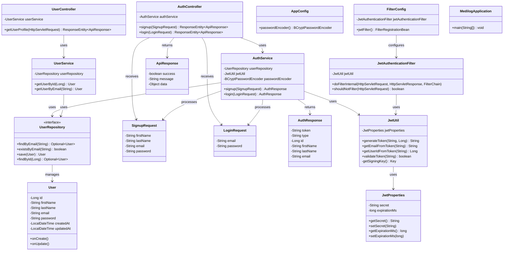

# MediLog System Design & Architecture

## 📊 Current Class Diagram



## 🏗️ Current Architecture Analysis

### ✅ **What's Good (Following Best Practices)**

1. **Layered Architecture**: Clear separation of concerns

   - **Controller Layer**: Handles HTTP requests/responses
   - **Service Layer**: Contains business logic
   - **Repository Layer**: Data access abstraction
   - **Entity Layer**: Domain models

2. **Dependency Injection**: Using Spring's IoC container
3. **DTO Pattern**: Separate request/response objects
4. **Configuration Management**: Environment-based properties
5. **Security**: JWT authentication, password encryption

### ⚠️ **Areas for Improvement**

1. **Package Structure**: Redundant package naming
2. **Exception Handling**: Generic RuntimeException usage
3. **Validation**: Basic validation in controllers
4. **Testing**: No test classes visible
5. **Documentation**: Limited API documentation

## 🎯 System Design Principles & Improvements

### 1. **SOLID Principles**

#### **S - Single Responsibility Principle (SRP)**

✅ **Current**: Each class has one responsibility

- `AuthService` → Authentication logic
- `UserService` → User management
- `JwtUtil` → JWT operations

#### **O - Open/Closed Principle (OCP)**

⚠️ **Improvement Needed**: Add interfaces for services

#### **L - Liskov Substitution Principle (LSP)**

✅ **Current**: Repository interfaces follow this

#### **I - Interface Segregation Principle (ISP)**

⚠️ **Improvement**: Create specific interfaces

#### **D - Dependency Inversion Principle (DIP)**

✅ **Current**: Controllers depend on service abstractions

### 2. **Clean Architecture Layers**

```
┌─────────────────────────────────────┐
│           Controllers               │ ← Presentation Layer
├─────────────────────────────────────┤
│            Services                 │ ← Business Logic Layer
├─────────────────────────────────────┤
│          Repositories               │ ← Data Access Layer
├─────────────────────────────────────┤
│            Entities                 │ ← Domain Layer
└─────────────────────────────────────┘
```

### 3. **Design Patterns Used**

1. **Repository Pattern**: `UserRepository`
2. **DTO Pattern**: Request/Response objects
3. **Dependency Injection**: Spring IoC
4. **Filter Pattern**: `JwtAuthenticationFilter`
5. **Configuration Pattern**: `JwtProperties`

## 🚀 Recommended Improvements

### 1. **Add Service Interfaces**

```java
public interface AuthService {
    AuthResponse signup(SignupRequest request);
    AuthResponse login(LoginRequest request);
}

@Service
public class AuthServiceImpl implements AuthService {
    // Implementation
}
```

### 2. **Custom Exception Handling**

```java
@ControllerAdvice
public class GlobalExceptionHandler {
    @ExceptionHandler(UserNotFoundException.class)
    public ResponseEntity<ApiResponse> handleUserNotFound(UserNotFoundException ex) {
        return ResponseEntity.status(404)
            .body(new ApiResponse(false, ex.getMessage()));
    }
}
```

### 3. **Input Validation**

```java
public class SignupRequest {
    @NotBlank(message = "First name is required")
    private String firstName;

    @Email(message = "Invalid email format")
    private String email;

    @Size(min = 6, message = "Password must be at least 6 characters")
    private String password;
}
```

### 4. **API Documentation**

```java
@RestController
@RequestMapping("/api/auth")
@Tag(name = "Authentication", description = "Authentication endpoints")
public class AuthController {

    @PostMapping("/signup")
    @Operation(summary = "User registration")
    @ApiResponse(responseCode = "200", description = "User registered successfully")
    public ResponseEntity<ApiResponse> signup(@Valid @RequestBody SignupRequest request) {
        // Implementation
    }
}
```

## 📚 System Design Principles Explained

### 1. **Separation of Concerns**

**What**: Each module should have a single, well-defined responsibility
**Why**: Makes code maintainable, testable, and reusable
**Example**: Your `AuthService` only handles authentication, not user management

### 2. **Dependency Inversion**

**What**: High-level modules shouldn't depend on low-level modules
**Why**: Makes code flexible and testable
**Example**: `AuthController` depends on `AuthService` interface, not implementation

### 3. **Don't Repeat Yourself (DRY)**

**What**: Avoid code duplication
**Why**: Reduces maintenance burden
**Example**: Your `ApiResponse` class standardizes all API responses

### 4. **You Aren't Gonna Need It (YAGNI)**

**What**: Don't add functionality until you need it
**Why**: Prevents over-engineering
**Example**: You didn't add complex user roles until needed

### 5. **Keep It Simple, Stupid (KISS)**

**What**: Prefer simple solutions over complex ones
**Why**: Easier to understand and maintain
**Example**: Your JWT implementation is straightforward

## 🎯 Next Steps for Better System Design

1. **Add Integration Tests**
2. **Implement Global Exception Handling**
3. **Add Input Validation Annotations**
4. **Create Service Interfaces**
5. **Add API Documentation (Swagger)**
6. **Implement Logging Strategy**
7. **Add Health Checks**
8. **Consider Caching Strategy**

Your current architecture is solid for a starting application! The main improvements would be around error handling, validation, and testing.

##

🎯 **System Design Improvements Implemented**

### **1. Exception Handling Strategy**

#### **Before (Poor Design):**

```java
// Generic exceptions everywhere
throw new RuntimeException("User not found");
throw new RuntimeException("Email already exists");
```

#### **After (Good Design):**

```java
// Specific, meaningful exceptions
throw new UserNotFoundException("User not found with ID: " + id);
throw new EmailAlreadyExistsException("An account with this email already exists");
throw new InvalidCredentialsException("Invalid email or password");
```

**Benefits:**

- ✅ **Specific Error Types**: Each error has its own exception class
- ✅ **Global Handling**: `@ControllerAdvice` handles all exceptions centrally
- ✅ **Consistent Responses**: All errors return standardized `ApiResponse`
- ✅ **Proper HTTP Status Codes**: 404 for not found, 409 for conflicts, etc.

### **2. Input Validation Strategy**

#### **Before (Manual Validation):**

```java
// Manual validation in controller
if (request.getEmail() == null || request.getEmail().trim().isEmpty()) {
    return ResponseEntity.badRequest().body(new ApiResponse(false, "Email is required"));
}
```

#### **After (Annotation-Based Validation):**

```java
// Declarative validation in DTOs
@NotBlank(message = "Email is required")
@Email(message = "Please provide a valid email address")
private String email;

// Controller uses @Valid
public ResponseEntity<ApiResponse> signup(@Valid @RequestBody SignupRequest request)
```

**Benefits:**

- ✅ **Declarative**: Validation rules are clear and visible
- ✅ **Reusable**: Same validation works everywhere the DTO is used
- ✅ **Automatic**: Spring handles validation automatically
- ✅ **Consistent**: All validation errors have the same format

### **3. Logging Strategy**

#### **Before (No Logging):**

```java
// Silent operations - hard to debug
User user = userRepository.save(newUser);
```

#### **After (Structured Logging):**

```java
// Comprehensive logging at different levels
log.info("User registered successfully with ID: {}", savedUser.getId());
log.warn("Login failed - user not found: {}", request.getEmail());
log.debug("Fetching user by ID: {}", id);
```

**Benefits:**

- ✅ **Observability**: Track what's happening in production
- ✅ **Debugging**: Easy to trace issues
- ✅ **Security**: Log security events (failed logins, etc.)
- ✅ **Performance**: Monitor slow operations

### **4. Transaction Management**

#### **Added Transactional Boundaries:**

```java
@Transactional
public AuthResponse signup(SignupRequest request) {
    // All database operations in one transaction
}
```

**Benefits:**

- ✅ **Data Consistency**: All-or-nothing operations
- ✅ **Rollback**: Automatic rollback on errors
- ✅ **Performance**: Optimized database connections

### **5. Security Improvements**

#### **Password Handling:**

```java
// Remove password from responses
user.setPassword(null);
```

#### **Input Sanitization:**

```java
// Normalize email addresses
user.setEmail(request.getEmail().toLowerCase().trim());
```

**Benefits:**

- ✅ **Data Protection**: Passwords never returned in responses
- ✅ **Consistency**: Emails stored in consistent format
- ✅ **Security**: Prevent injection attacks

## 📚 **System Design Principles Applied**

### **1. Single Responsibility Principle (SRP)**

Each class has one clear purpose:

- `AuthController` → Handle HTTP authentication requests
- `AuthService` → Business logic for authentication
- `UserRepository` → Data access for users
- `JwtUtil` → JWT token operations
- `GlobalExceptionHandler` → Centralized error handling

### **2. Open/Closed Principle (OCP)**

- **Open for Extension**: Can add new exception types easily
- **Closed for Modification**: Core logic doesn't change when adding features

### **3. Dependency Inversion Principle (DIP)**

- Controllers depend on Service interfaces (abstractions)
- Services depend on Repository interfaces (abstractions)
- High-level modules don't depend on low-level details

### **4. Don't Repeat Yourself (DRY)**

- `ApiResponse` standardizes all API responses
- `GlobalExceptionHandler` centralizes error handling
- Validation annotations eliminate duplicate validation code

### **5. Fail Fast Principle**

- Input validation happens immediately at controller level
- Database constraints prevent invalid data
- Meaningful error messages help developers debug quickly

## 🏗️ **Architecture Patterns Used**

### **1. Layered Architecture**

```
Controllers (Presentation) → Services (Business) → Repositories (Data) → Entities (Domain)
```

### **2. Repository Pattern**

- Abstracts data access logic
- Makes testing easier (can mock repositories)
- Separates business logic from data persistence

### **3. DTO Pattern**

- Separate objects for API requests/responses
- Validation rules attached to DTOs
- Prevents exposing internal entity structure

### **4. Dependency Injection Pattern**

- Spring manages object creation and dependencies
- Makes code testable and flexible
- Follows Inversion of Control principle

## 🚀 **Performance & Scalability Considerations**

### **Current Good Practices:**

1. **Connection Pooling**: Spring Boot auto-configures database connection pooling
2. **Lazy Loading**: JPA entities use lazy loading by default
3. **Caching Ready**: Structure supports adding caching layers
4. **Stateless Design**: JWT tokens make the API stateless (horizontally scalable)

### **Future Scalability Improvements:**

1. **Add Caching**: Redis for session management and frequently accessed data
2. **Database Indexing**: Add indexes on frequently queried fields (email)
3. **Rate Limiting**: Prevent abuse of authentication endpoints
4. **Monitoring**: Add metrics and health checks

## 🧪 **Testing Strategy (Recommended Next Steps)**

### **Unit Tests:**

```java
@ExtendWith(MockitoExtension.class)
class AuthServiceTest {
    @Mock private UserRepository userRepository;
    @Mock private JwtUtil jwtUtil;
    @InjectMocks private AuthService authService;

    @Test
    void signup_ShouldThrowException_WhenEmailExists() {
        // Test exception scenarios
    }
}
```

### **Integration Tests:**

```java
@SpringBootTest
@AutoConfigureTestDatabase
class AuthControllerIntegrationTest {
    @Test
    void signup_ShouldReturnSuccess_WhenValidRequest() {
        // Test full request/response cycle
    }
}
```

## 📊 **Metrics & Monitoring (Future)**

### **Application Metrics:**

- Request/response times
- Error rates by endpoint
- Database query performance
- JWT token generation/validation times

### **Business Metrics:**

- User registration rates
- Login success/failure rates
- API usage patterns

## 🔒 **Security Best Practices Implemented**

1. **Password Encryption**: BCrypt with salt
2. **JWT Security**: Signed tokens with expiration
3. **Input Validation**: Prevent malicious input
4. **Error Handling**: Don't expose internal details
5. **Logging**: Security events are logged
6. **CORS**: Configured for cross-origin requests

## 📈 **What Makes This a "Good" System Design**

### **Maintainability:**

- Clear separation of concerns
- Consistent error handling
- Comprehensive logging
- Standardized responses

### **Testability:**

- Dependency injection enables mocking
- Each layer can be tested independently
- Validation logic is isolated

### **Scalability:**

- Stateless design (JWT)
- Layered architecture supports horizontal scaling
- Database connection pooling

### **Security:**

- Input validation prevents attacks
- Passwords are properly encrypted
- Sensitive data is not exposed

### **Developer Experience:**

- Clear error messages
- Consistent API responses
- Good logging for debugging
- Validation feedback

This architecture follows industry best practices and is ready for production use while being maintainable and scalable!
